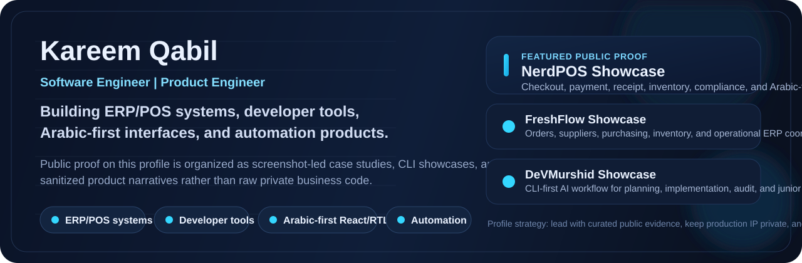
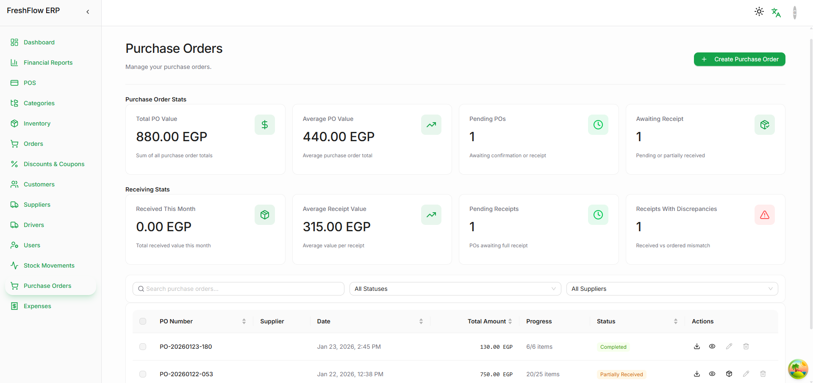
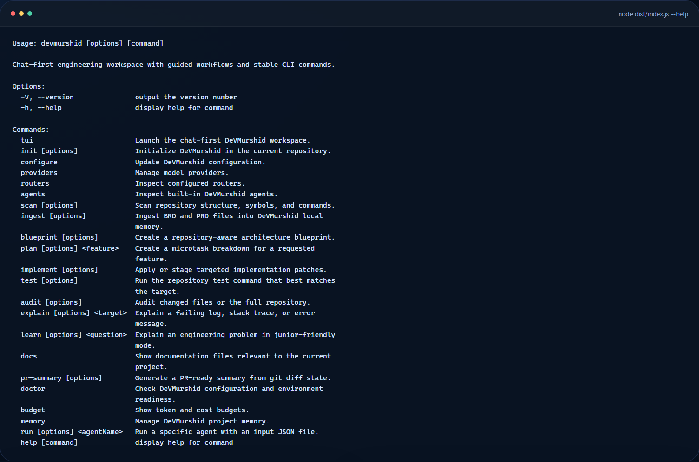
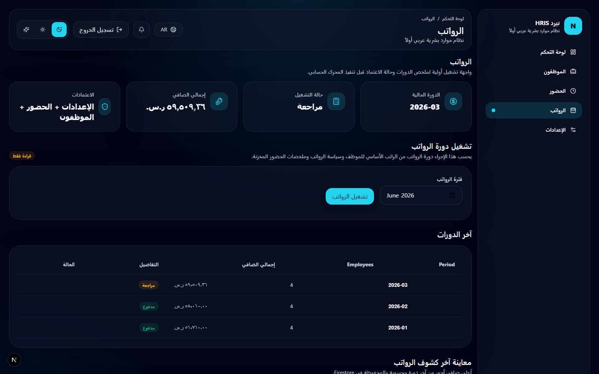

  
  <h1>Kareem Qabil</h1>
  
<strong>Software Engineer building ERP/POS systems, developer tools, Arabic-first interfaces, and automation products.</strong>

  

    <a href="https://www.linkedin.com/in/kerimqabil/">LinkedIn</a>
    |
    <a href="https://kerimqabil.me">Portfolio</a>
    |
    <a href="https://github.com/KareemQabil/nerdpos-showcase">NerdPOS Showcase</a>
    |
    <a href="https://github.com/KareemQabil/devmurshid-showcase">DeVMurshid Showcase</a>
  

## Selected public work

<table>
  <tr>
    <td width="50%" valign="top">
      
       
      <strong>NerdPOS Showcase</strong>
       
      Public-safe ERP/POS case study with real checkout, payment, receipt, inventory, and compliance surfaces.
    </td>
    <td width="50%" valign="top">
      
       
      <strong>FreshFlow Showcase</strong>
       
      Collaboration-led ERP case study covering purchasing, suppliers, inventory, drivers, and back-office operations.
    </td>
  </tr>
  <tr>
    <td width="50%" valign="top">
      
       
      <strong>DeVMurshid Showcase</strong>
       
      AI-assisted developer tooling case study with real CLI output, workflow stages, and safety-oriented delivery controls.
    </td>
    <td width="50%" valign="top">
      
       
      <strong>nerdHRIS Showcase</strong>
       
      Arabic-first HRIS direction focused on employee records, payroll, and internal administrative workflows.
    </td>
  </tr>
</table>

## What I build

- ERP/POS systems and business workflow software
- React and TypeScript dashboards, admin panels, and internal tools
- Arabic-first and RTL user interfaces
- AI-assisted developer tools and CLI workflows
- Automation products and educational tools for junior developers

## Current focus

- turning private product work into public-safe case studies with real screenshots and clear engineering narratives
- building developer tools that help junior programmers debug, understand code, and ship with more structure
- improving architecture quality, documentation, testing posture, and product workflow clarity

## Public work strategy

Some of my strongest business systems should not be published as raw repositories. The public side of this profile is built to show real interface evidence, workflow depth, and engineering judgment without exposing private business logic, customer-specific workflows, operational data, or sensitive infrastructure details.

## Open next

- [freshflow-showcase](https://github.com/KareemQabil/freshflow-showcase)
- [nerdprm-showcase](https://github.com/KareemQabil/nerdprm-showcase)
- [KareemQabil.github.io](https://github.com/KareemQabil/KareemQabil.github.io)
- [kerimqabil.me](https://kerimqabil.me)

## Contact

- LinkedIn: https://www.linkedin.com/in/kerimqabil/
- Portfolio: https://kerimqabil.me
